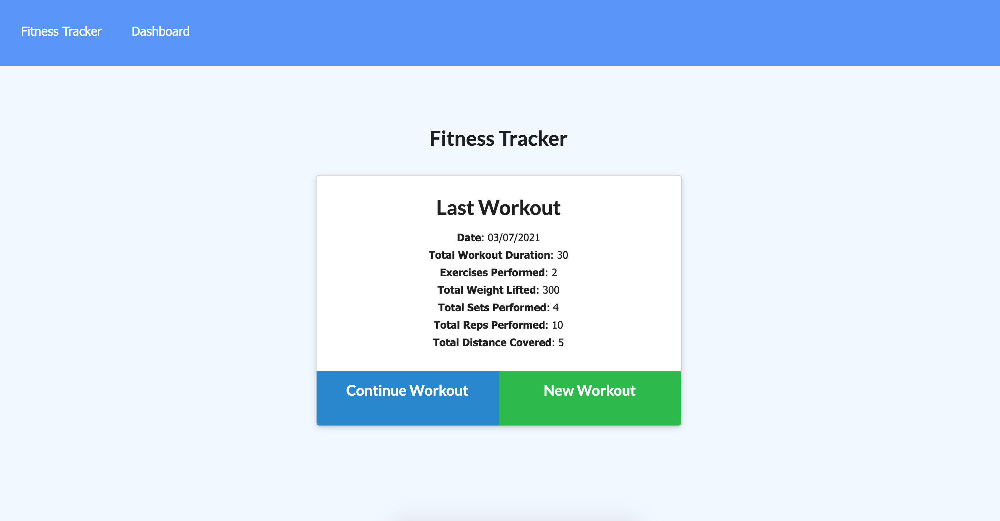
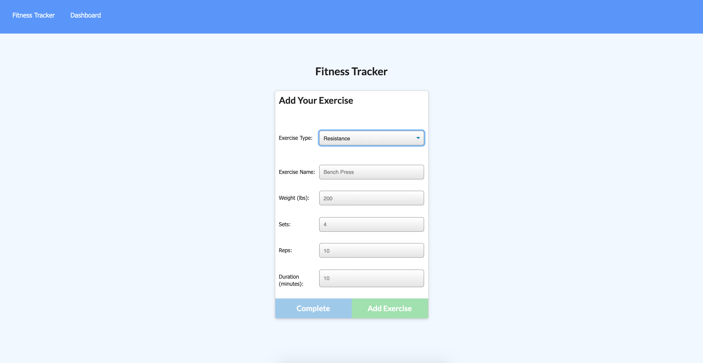
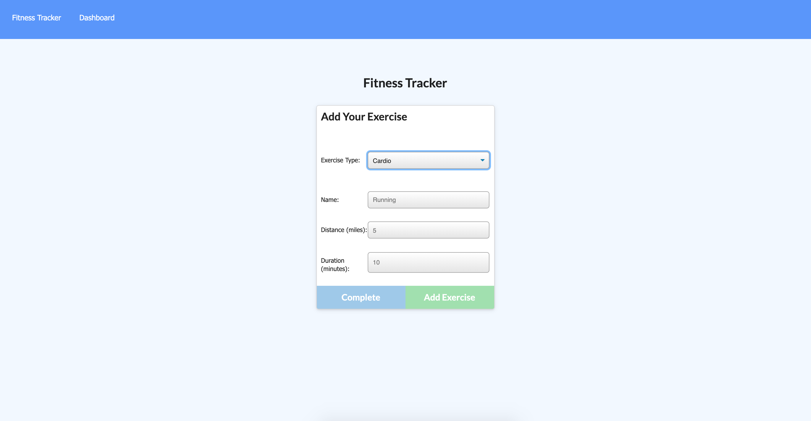
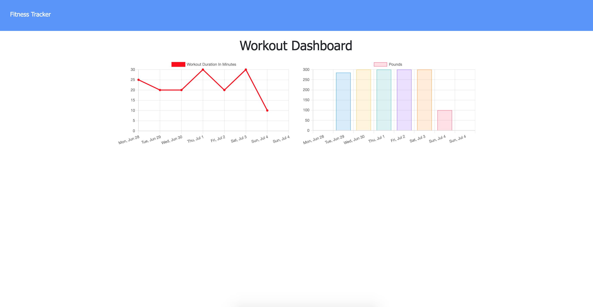

## Workout Tracker

A simple application using mongoDB and Mongoose schema which allow users to log their multiple exercises in a workout on a given day.

## Deployment

This app is deployed on heroku: https://damp-river-13061.herokuapp.com/

## Screenshots
Landing Page

---

New Resistance Exercise

---

New Cardio Exercise

---

Stats Page

---
